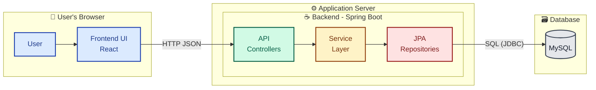
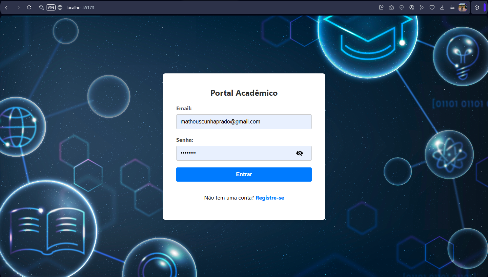
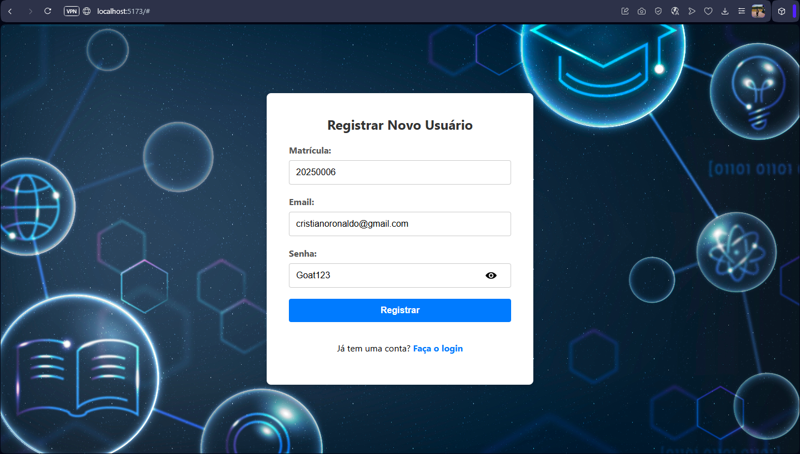
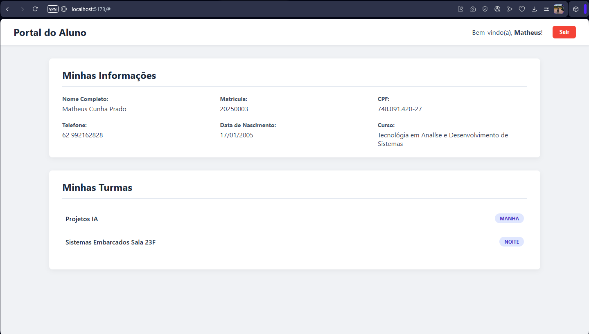
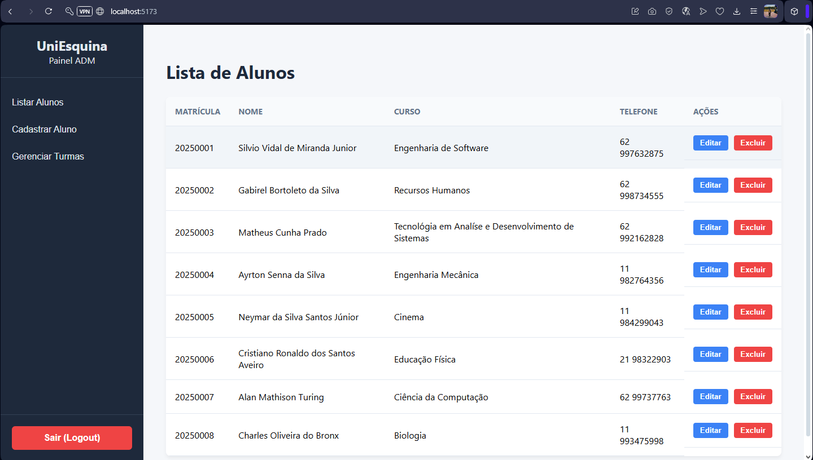
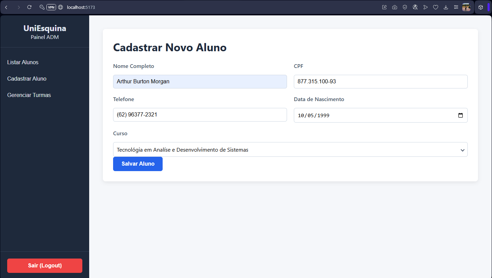
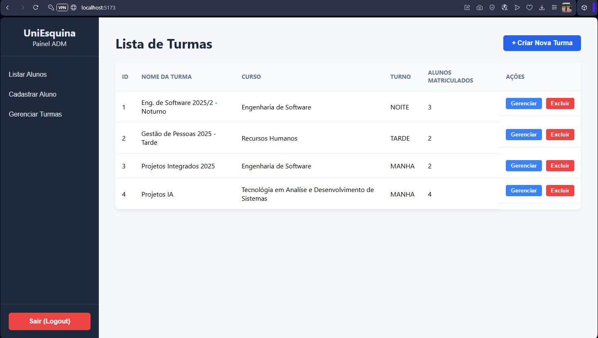
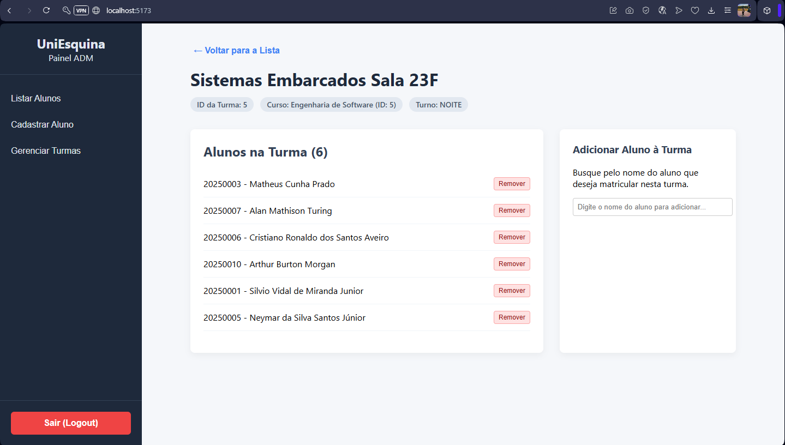
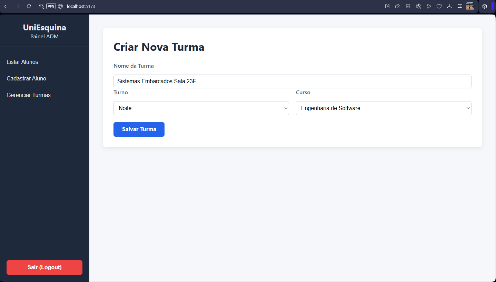

<div align="center">
  <p>
    <strong>Languages:</strong>
    <a href="README.en.md">🇺🇸 English</a>
    &nbsp;|&nbsp;
    <a href="README.md">🇧🇷 Portuguese</a>
  </p>
</div>

---
<div align="center">

# 🎓 Academic Management System v2.0 🚀

### The Evolution from a CLI Application to a Modern Full-Stack Solution

</div>

 
 
 
 
 
 


---

## 📜 Quick Index

| [About the Project](#-about-the-project) | [Features](#-features) | [Technologies Used](#-technologies-used) |
| :--- | :--- | :--- |
| [Monorepo Structure](#-project-structure) | [How to Run](#-setup-and-execution) | [Default Credentials](#-access-credentials) |
| [Application Flow](#-application-flow) | [API Endpoints](#-api-endpoints) | [Deep Technical Dive](#-deep-technical-dive) |
| [Legacy CLI Version](#-legacy-cli-version-v10) | [Future Roadmap](#-future-roadmap) | [Project Screenshots](#-project-screenshots) |

---

<a name="-about-the-project"></a>
## 🌟 About the Project

**UniEsquina v2.0** represents the complete modernization and re-engineering of an academic management system, transforming a robust console application (CLI) into a dynamic and interactive **Full-Stack** solution. The project has been meticulously refactored to adopt the best market practices, with a powerful backend in **Spring Boot** and a reactive frontend built with **React**.

This new version not only replicates but expands upon the original functionalities, offering a rich user experience through dedicated web interfaces for **Administrator** and **Student** profiles, complete with an authentication and registration system. And now, fully containerized with **Docker**, allowing the entire application to be executed with a single command.

<a name="-features"></a>
## ✨ Features

### 🏢 **Administrator Panel**
The total control center of the system, accessible only by admin users.

- 🔐 **Secure Login:** Access to a restricted area.
- 📊 **Modular Dashboard:** Interface with a navigation sidebar for quick access to all features.
- 👨‍🎓 **Student Management (Full CRUD):**
    - 📋 **List** all students with search and future pagination.
    - ✅ **Register** new students with real-time data validation and course selection fetched directly from the API.
    - ✏️ **Edit** complete information of already registered students.
    - 🗑️ **Delete** students from the system (with cascading removal from classes).
- 🏫 **Class Management (Full CRUD):**
    - 📄 **List** all classes, their courses, and the number of students.
    - ✅ **Create** new classes, associating them with an existing course.
    - 🗑️ **Delete** classes.
    - 🔎 **Manage** a specific class, with functionalities to:
        - ➕ **Add** existing students to the class through a name search with autocomplete.
        - ➖ **Remove** students from the class with one click.

### 🧑‍🎓 **Student Portal**
A personal and informative area for each enrolled student.

- 🔑 **Login and Registration:** Students with valid enrollments can create and access their accounts.
- 🎨 **Personalized Dashboard:** A clean and polished interface for data visualization.
- ℹ️ **My Information:** A detailed card with all personal and academic data of the logged-in student.
- 📚 **My Classes:** A list of all classes in which the student is currently enrolled.

---
<a name="-technologies-used"></a>
## 🛠️ Technologies Used

| Area | Technology | Description |
| :--- | :--- | :--- |
| ☁️ **Backend** | **Java 17+** | Main language of the application. |
| | **Spring Boot 3.x**| Framework for creating the REST API and managing the application. |
| | **Spring Data JPA**| Abstraction layer for data persistence. |
| | **Hibernate** | JPA implementation for object-relational mapping (ORM). |
| | **Maven** | Dependency and build manager for the project. |
| 🌐 **Frontend** | **React 18+** | Library for building the user interface (UI). |
| | **Vite** | High-performance build tool and development server. |
| | **JavaScript (ES6+)**| Main language for the frontend logic. |
| | **CSS3** | Component styling for a modern interface. |
| 🗃️ **Database**| **MySQL 8.x** | Relational Database Management System. |
| 🐳 **DevOps**| **Docker & Docker Compose**| Application containerization for portability and simplified deployment. |
| 🔄 **Version Control**| **Git & GitHub** | Source code management and versioning. |

---
<a name="-project-structure"></a>
## 📂 Project Structure

The project adopts a **monorepo** architecture, with the backend and frontend code logically separated into distinct folders but contained within the same repository for easier management.

```
FaculdadeCRUD_ProjetoFinal/
├── .git/
├── .gitignore
├── backend/            # ☕ Backend Project (Spring Boot API)
│   ├── src/
│   ├── pom.xml
│   └── Dockerfile
├── frontend/           # ⚛️ Frontend Project (React + Vite)
│   ├── public/
│   ├── src/
│   ├── package.json
│   └── Dockerfile
├── docker-compose.yml  # 🐳 Container orchestration file
└── README.md           # 📍 You are here!
```
---
<a name="-setup-and-execution"></a>
## 🚀 Setup and Execution

There are two main ways to run this project. The Docker method is highly recommended for its simplicity and portability.

### **Option 1: Running with Docker (Recommended)**
This is the simplest way to get the entire application (frontend, backend, and database) up and running with a single command.

**Prerequisites:**
- **Docker:** [Installed](https://docs.docker.com/engine/install/) and running.
- **Docker Compose:** (Usually comes with Docker Desktop).
- **Git:** To clone the repository.

**Steps:**
1.  **Clone the repository:**
    ```bash
    git clone https://github.com/MathCunha16/faculdade-crud.git
    cd faculdade-crud
    ```
2.  **Run Docker Compose:**
    In the project root (where the `docker-compose.yml` file is), run:
    ```bash
    docker compose up
    ```
    * *Tip: add the `-d` flag to run in detached mode (background) and `--build` if you need to force a rebuild of the images after a code change.*
3.  **Access the application:**
    -   The frontend will be available at **[http://localhost:3000](http://localhost:3000)**.
    -   The backend API will be at `http://localhost:8080`.

4.  **To stop everything:**
    ```bash
    docker compose down
    ```

<details>
<summary><b>Option 2: Using Pre-built Images from Docker Hub (Quick Alternative)</b></summary>
<br>
If you don't want to build the images from the source code, you can use the versions already published on Docker Hub. To do this, use this alternative `docker-compose.yml` which uses the `image` directive instead of `build`.

```yaml
services:
  db:
    image: mysql:8.0
    container_name: mysql-db-compose
    environment:
      MYSQL_ROOT_PASSWORD: Developer123
      MYSQL_DATABASE: faculdade
    ports:
      - "3307:3306"
    volumes:
      - mysql_data:/var/lib/mysql

  backend:
    image: mathcunha16/faculdade-crud-backend:latest
    container_name: backend-api-compose
    restart: on-failure
    depends_on:
      - db
    ports:
      - "8080:8080"
    environment:
      - SPRING_DATASOURCE_URL=jdbc:mysql://db:3306/faculdade?useSSL=false&allowPublicKeyRetrieval=true
      - SPRING_DATASOURCE_USERNAME=root
      - SPRING_DATASOURCE_PASSWORD=Developer123

  frontend:
    image: mathcunha16/faculdade-crud-frontend:latest
    container_name: frontend-ui-compose
    ports:
      - "3000:80"

volumes:
  mysql_data:
```
</details>

### **Option 3: Manual Execution (Local Environment)**
Follow the steps below if you prefer to set up and run each part of the application manually.

**Prerequisites**
- **Java JDK:** Version 17 or higher.
- **Maven:** Installed and configured in the system's `PATH`.
- **Node.js:** Version 18 or higher (includes `npm`).
- **MySQL:** Database server running (XAMPP, Docker, etc.).

#### 1. Backend (Spring Boot API)
1.  **Create the Database:** In your MySQL client, execute:
    ```sql
    CREATE DATABASE IF NOT EXISTS faculdade;
    ```
2.  **Configure the Connection:** Open the `backend/src/main/resources/application.yml` file and enter your MySQL credentials in the `username` and `password` fields.
3.  **Run the Application:** Open a terminal inside the `backend/` folder and run the Maven command:
    ```bash
    # On Windows
    mvnw.cmd spring-boot:run

    # On Mac/Linux
    ./mvnw spring-boot:run
    ```
    Alternatively, import the project into your IDE (Eclipse, IntelliJ) as an "Existing Maven Project" and run the main class `FaculdadeCrudApplication.java`.
4.  The backend will be running at `http://localhost:8080`. The first run will automatically create and populate the tables via `data.sql`.

#### 2. Frontend (React Interface)
1.  **Open another terminal**, separate from the backend.
2.  **Navigate to the frontend folder:**
    ```bash
    cd frontend
    ```
3.  **Install dependencies** (you only need to do this the first time):
    ```bash
    npm install
    ```
4.  **Start the Vite development server:**
    ```bash
    npm run dev
    ```
5.  Open your browser and access the provided address, which is usually `http://localhost:5173`.

---
<a name="-access-credentials"></a>
## 🔑 Access Credentials

Use the following default credentials to test the different user profiles. They are automatically created by `data.sql` (in manual execution) or by the Docker volume.

| Profile | Email | Password |
| :--- | :--- | :--- |
| 👑 **Administrator** | `matheuscunhaprado@gmail.com` | `Cunha123` |
| 🧑‍🎓 **Student 1** | `silviovidal@gmail.com` | `MatheusLindo` |
| 🧑‍🎓 **Student 2** | `bortoleto@outlook.com` | `Bortoleto123` |

---
<a name="-application-flow"></a>
## 🔄 Application Flow

The diagram below illustrates the application's architecture and communication flow.



---
<a name="-api-endpoints"></a>
## 🌐 API Endpoints

The backend REST API exposes the following main endpoints:

| HTTP Verb | Endpoint | Description |
| :--- | :--- | :--- |
| `POST` | `/api/login` | Authenticates a user and returns their data. |
| `POST` | `/api/registrar` | Registers a new login for a student with a valid enrollment. |
| `GET` | `/api/alunos` | Lists all students. |
| `GET` | `/api/alunos/buscar` | Searches for students by part of their name (`?nome=...`). |
| `POST` | `/api/alunos` | Creates a new student. |
| `PUT` | `/api/alunos/{matricula}` | Updates a student's data. |
| `DELETE` | `/api/alunos/{matricula}` | Deletes a student. |
| `GET` | `/api/turmas` | Lists all classes. |
| `POST`| `/api/turmas` | Creates a new class. |
| `DELETE`| `/api/turmas/{id}`| Deletes a class. |
| `POST`| `/api/turmas/{id}/alunos` | Adds a student to a class. |
| `DELETE`| `/api/turmas/{id}/alunos/{mat}` | Removes a student from a class. |
| `GET` | `/api/cursos` | Lists all available courses. |

---
<a name="-deep-technical-dive"></a>
## 🔬 Deep Technical Dive

* **Backend - Layered Architecture:** The project adopts the **Controller-Service-Repository** pattern, ensuring a clear separation of concerns.
    -   `Controller`: Receives HTTP requests and orchestrates the response.
    -   `Service`: Contains complex business logic (e.g., enrollment number generation).
    -   `Repository`: Spring Data JPA interface responsible for database communication.
* **Backend - Persistence with JPA:** The migration from JDBC to **Spring Data JPA** abstracted away all the complexity of writing SQL, managing connections, and mapping results. Using `JpaRepository` interfaces allows Spring to create queries at runtime, including custom lookups like `findByMatricula` and `findByNomeContainingIgnoreCase`.
* **Backend - Data Initialization:** The final and robust strategy uses an **idempotent** `data.sql` script with `CREATE TABLE IF NOT EXISTS` and `INSERT IGNORE`, combined with `ddl-auto: none` in `application.yml`. This ensures the database has the correct structure and initial data in any environment, without deleting existing data on subsequent runs.
* **Frontend - Component Architecture:** The UI was built in **React**, breaking it down into reusable components (`LoginForm`, `AlunoList`, `Sidebar`, etc.), each with its own state and logic.
* **Frontend - State Management:** The application's state (e.g., which user is logged in, which screen is visible) is managed in the parent component (`App.jsx`) and distributed to child components via **props**. This pattern, known as **"Lifting State Up"**, centralizes control and facilitates communication between components.
* **Frontend - Effects and Data Fetching:** The `useEffect` hook is used to trigger asynchronous API calls (`fetch`) when components are mounted on the screen, allowing the UI to be populated with data from the backend.

---
<a name="-legacy-cli-version-v10"></a>
## 💾 Legacy CLI Version (v1.0)

The original version of this project, a fully functional console application, has been preserved and is available for review in the **[Release v1.0-cli](https://github.com/MathCunha16/faculdade-crud/releases/tag/v1.0-cli)** of the repository.

---
<a name="-future-roadmap"></a>
## 📈 Future Roadmap

- [ ] **API Security:** Implement token-based authentication (JWT) to protect endpoints.
- [ ] **Testing:** Add unit tests (JUnit in the backend, Vitest/RTL in the frontend).
- [ ] **Pagination:** Implement pagination in the student and class lists for better performance with large data volumes.
- [ ] **UX Improvements:** Replace `alert()`s with a more elegant notification system (toasts).
- [ ] **Refactoring:** Move additional business logic from controllers to the Service layer.

---
<a name="-project-screenshots"></a>
## 📸 Project Screenshots

<div align="center">

### 1. Login Screen


### 2. Student Registration Screen


### 3. Student Dashboard


### 4. Admin Dashboard - Listing Students


### 5. Admin Dashboard - Registering New Student


### 6. Admin Dashboard - Managing Classes


### 7. Admin Dashboard - Managing a Specific Class


### 8. Admin Dashboard - Creating New Class


</div>

---
<a name="-license"></a>
## 📄 License
Distributed under the MIT License.
