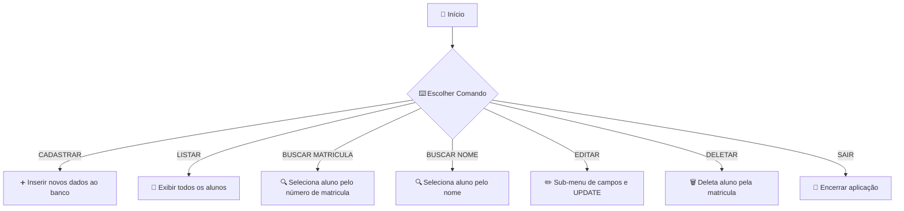

# 🎓 Sistema de Gestão de Alunos com JDBC 🚀

  
  
  


---

## 📜 Índice Rápido  
| [Novos Recursos v1.0](#novos-recursos-v10) | [Estrutura do Projeto](#estrutura-do-projeto) |  
| [Configuração Inicial](#configuração-inicial) | [Fluxo de Operações](#fluxo-de-operações) |  
| [Componentes Principais](#componentes-principais) | [Roadmap](#roadmap) |  
| [Licença](#licença) | [Detalhamento Técnico Profundo](#detalhamento-técnico-profundo) |  

---

<a name="novos-recursos-v10"></a>
## 🌟 Novos Recursos v1.0

- 🗃️ **Inicialização Automática** da tabela `aluno` via Java (JDBC)  
- 🔄 **CRUD Completo** (Create, Read, Update, Delete)  
- 🎛️ **Menu CLI** com comandos intuitivos  
- 🔍 **Busca por Matrícula e Nome**  
- ✅❌ **Feedback e Validação** em todas as entradas  
- 🚨 **Tratamento de Erros** granulado com exceções customizadas  

---

<a name="estrutura-do-projeto"></a>
## 📂 Estrutura do Projeto

```bash
src/
├── db/
│   ├── DB.java                     # 🔌 Gerenciamento de conexões
│   ├── DbException.java            # ❌ Exceções de persistência
│   └── InicializadorBanco.java     # 🛠️ Criação da tabela `aluno`
├── model/
│   └── Aluno.java                  # 🧱 Entidade `Aluno`
│   └── Curso.java                  # 📜 Enum de Cursos
├── dao/
│   └── AlunoDAO.java               # 📊 Operações CRUD em `aluno`
└── faculdade/
    └── FaculdadeMain.java          # 💻 CLI principal, menu e fluxo
```

---

<a name="configuração-inicial"></a>
## ⚙️ Configuração Inicial

1. **Banco de Dados MySQL**  
   ```sql
   CREATE DATABASE faculdade;
   USE faculdade;
   -- A tabela será criada automaticamente pelo Java no primeiro run
   ```

2. **Arquivo de Propriedades** (`db.properties`)
   ```properties
   user=seu_usuario
   password=sua_senha
   dburl=jdbc:mysql://127.0.0.1:3306/faculdade
   useSSL=false
   ```

3. **Dependências**  
   - 📥 Baixe o driver JDBC do MySQL (Connector/J 8.x)  
   - ➕ Adicione o `.jar` no classpath do Eclipse  

> **⚠️ Importante**  
> - Renomeie `db.config.example.properties` para `db.properties`.  
> - Preencha com suas credenciais.  
> - Garanta que o MySQL esteja rodando e acessível em `localhost:3306`.

---

<a name="fluxo-de-operações"></a>
## 🔄 Fluxo de Operações



---

<a name="componentes-principais"></a>
## 💻 Comandos Disponíveis

```bash
> CADASTRAR
# Solicita nome, telefone, data (DD/MM/yyyy), curso, CPF
# Gera matrícula e insere no banco

> LISTAR
# Exibe tabela formatada com todos os alunos

> BUSCAR MATRICULA
# Pede matrícula e mostra dados do aluno (ou "não encontrado")

> BUSCAR NOME
# Pede fragmento de nome e lista correspondências

> EDITAR
# Pede matrícula, exibe sub-menu de campos, atualiza via DAO

> DELETAR
# Pede matrícula e remove o registro

> SAIR
# Fecha conexão e encerra programa
```

---

<a name="roadmap"></a>
## 📈 Roadmap

| Status | Recurso                      | Versão |
|--------|------------------------------|-------:|
| ✅     | CRUD Básico                  |  v1.0  |
| ✅     | Inicializador de Tabela      |  v1.0  |
| 🚧     | Camada de Serviço (Service)  |  v1.1  |
| 🚧     | Interface Gráfica (GUI)      |  v2.0  |
| ⌛     | Testes Unitários (JUnit 5)   |  v1.2  |

---

<a name="licença"></a>
## 📄 Licença

MIT License – veja o arquivo [LICENSE](LICENSE) para detalhes.

---

<a name="detalhamento-técnico-profundo"></a>
# 🔧 Detalhamento Técnico Profundo

## 🛠️ Gerenciamento de Conexões

### Classe `DB.java` (Singleton simplificado)
```java
public class DB {
    public static Connection getConnection() {
        Properties props = loadProperties();
        String url = props.getProperty("dburl") + "?allowPublicKeyRetrieval=true";
        return DriverManager.getConnection(url, props);
    }
    public static void closeConnection(Connection conn) {
        if (conn != null) conn.close();
    }
    // loadProperties()…
}
```

## 🗃️ Inicialização de Tabela

### Classe `InicializadorBanco.java`
```java
public class InicializadorBanco {
    public static void inicializar() {
        try (Connection conn = DB.getConnection();
             Statement st = conn.createStatement()) {
            st.execute(
              "CREATE TABLE IF NOT EXISTS aluno (" +
              "id INT AUTO_INCREMENT PRIMARY KEY," +
              "matricula INT UNIQUE NOT NULL," +
              "nome VARCHAR(255) NOT NULL," +
              "telefone VARCHAR(25)," +
              "data_de_nascimento DATE NOT NULL," +
              "curso VARCHAR(100) NOT NULL," +
              "CPF VARCHAR(15) NOT NULL" +
              ");"
            );
        }
    }
}
```

## 📦 Entidade de Domínio

### Classe `Aluno.java`
```java
public class Aluno {
    private Integer id;
    private Integer matricula;
    private String nome;
    private String telefone;
    private LocalDate dataDeNascimento;
    private Curso curso;
    private String cpf;
    // construtores, getters/setters…
}
```

## 📊 Padrão DAO

### Classe `AlunoDAO.java`
```java
public class AlunoDAO {
    public void inserirDados(Aluno a) { … }        // INSERT
    public List<Aluno> listarAlunos() { … }       // SELECT *
    public Aluno buscarPorMatricula(int m) { … }  // SELECT WHERE
    public List<Aluno> buscarPorNome(String n) { … }// LIKE %
    public boolean atualizarNome(int m, String n) { … } 
    // … demais métodos atualizarTelefone, atualizarDataNascimento, atualizarCurso, atualizarCpf
    public Aluno removerAluno(int m) { … }        // DELETE WHERE
}
```

## 🔄 Menu e Fluxo

### Classe `FaculdadeMain.java`
- **Loop principal** que lê comando e chama DAO  
- **Tratamento de exceções** `NumberFormatException`, `DateTimeParseException`  
- **Sub-menu de edição** para cada campo via `switch`

## 🚀 Padrões de Projeto Utilizados

| Padrão        | Aplicação                    | Benefícios                      |
|---------------|------------------------------|---------------------------------|
| **DAO**       | `AlunoDAO`                   | Isola lógica de persistência    |
| **Singleton** | `DB`                         | Único ponto de acesso a conexões|
| **Factory**   | `GeradorMatricula`           | Cria IDs padronizados           |

---

Este README foi gerado para servir como guia completo de setup, arquitetura e fluxos do seu projeto de gerenciamento de alunos com JDBC. Bom desenvolvimento!
