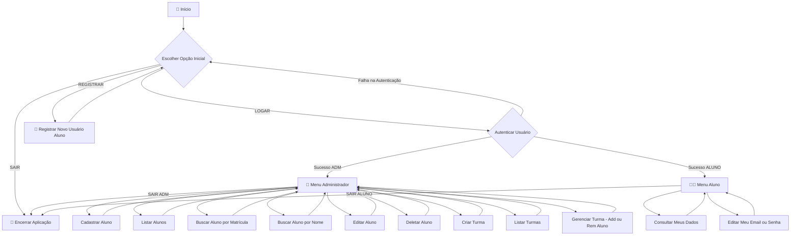

# 🎓 Sistema de Gestão Acadêmica com JDBC 🚀


---

## 📜 Índice Rápido
| [Funcionalidades Principais](#funcionalidades-principais) | [Estrutura do Projeto](#estrutura-do-projeto) |
| [Configuração Inicial](#configuração-inicial) | [Fluxo de Operações](#fluxo-de-operações) |
| [Menus e Comandos](#menus-e-comandos) | [Roadmap](#roadmap) |
| [Licença](#licença) | [Detalhamento Técnico Profundo](#detalhamento-técnico-profundo) |

---

<a name="funcionalidades-principais"></a>
## ✨ Funcionalidades Principais (v1.1 - Atualização Significativa)

- 🔐 **Autenticação de Usuários:** Sistema de login e registro para alunos e administradores.
- 👤 **Perfis de Usuário:**
    - **Administrador (ADM):** Controle total sobre alunos, turmas e visualização de usuários.
    - **Aluno:** Consulta de dados pessoais, informações de turmas e edição de credenciais de acesso.
- 🗃️ **Inicialização Automática do Banco de Dados:**
    - Criação automática das tabelas: `aluno`, `curso`, `turma`, `usuarios`, `controle_matricula` via Java (JDBC).
    - População inicial da tabela `curso` com uma lista de cursos pré-definidos.
    - Criação de um usuário administrador padrão e alunos de exemplo com contas de usuário associadas.
- 🔄 **CRUD Completo para Alunos (via ADM):**
    - Create, Read (listar todos, buscar por matrícula, buscar por nome), Update, Delete.
    - Geração automática de matrícula para novos alunos.
- 👨‍🏫 **Gerenciamento de Turmas (via ADM):**
    - Criar novas turmas associadas a cursos.
    - Listar todas as turmas.
    - Adicionar e remover alunos de turmas.
- 💻 **Menu CLI Interativo:**
    - Comandos intuitivos e feedback visual com cores para melhor experiência.
- ✅❌ **Validação de Entradas:**
    - Validação para CPF, nome, telefone, e-mail em cadastros e edições.
- 🚨 **Tratamento de Erros:**
    - Exceções customizadas (`DbException`) para erros de persistência.

---

<a name="estrutura-do-projeto"></a>
## 📂 Estrutura do Projeto

```bash
src/
├── db/
│   ├── DB.java                     # 🔌 Gerenciamento de conexões
│   ├── DbException.java            # ❌ Exceções de persistência
│   └── InicializadorBanco.java     # 🛠️ Criação e população inicial de todas as tabelas
├── model/
│   ├── Aluno.java                  # 🧱 Entidade Aluno
│   ├── Curso.java                  # 🎓 Entidade Curso
│   ├── EnumCurso.java              # 📜 Enum com a lista de Cursos e seus IDs
│   ├── TipoUsuario.java            # 🎭 Enum para tipos de usuário (ADM, ALUNO)
│   ├── Turma.java                  # 🏫 Entidade Turma
│   ├── Usuario.java                # 👤 Entidade Usuário (para login)
│   └── Validador.java              # ✅ Utilitário para validação de dados
├── dao/
│   ├── AlunoDAO.java               # 📊 Operações CRUD em Aluno e geração de matrícula
│   ├── TurmaDAO.java               # 🛠️ Operações CRUD em Turma e gerenciamento de alunos na turma
│   └── UsuarioDAO.java             # 🔑 Operações de autenticação e CRUD básico em Usuário
└── faculdade/
    ├── FaculdadeMain.java          # 💻 CLI principal, menus (ADM, ALUNO) e fluxo da aplicação
    └── Util.java                   # 🎨 Utilitários (Cores para console, seleção de curso)
```

---

<a name="configuração-inicial"></a>
## ⚙️ Configuração Inicial

1.  **Banco de Dados MySQL**
    ```sql
    CREATE DATABASE faculdade;
    USE faculdade;
    -- As tabelas (aluno, curso, turma, usuarios, controle_matricula)
    -- serão criadas e algumas populadas automaticamente pelo Java no primeiro 'run'
    ```

2.  **Arquivo de Propriedades** (`db.properties`)
    Deve estar na raiz do projeto.
    ```properties
    user=seu_usuario
    password=sua_senha
    dburl=jdbc:mysql://127.0.0.1:3306/faculdade
    useSSL=false
    ```

3.  **Dependências**
    * 📥 Baixe o driver JDBC do MySQL (Connector/J 8.x ou compatível).
    * ➕ Adicione o `.jar` ao classpath do seu projeto (ex: no Eclipse, "Build Path" -> "Configure Build Path..." -> "Libraries" -> "Add External JARs...").

> **⚠️ Importante**
> * Se houver um `db.config.example.properties`, renomeie-o para `db.properties`.
> * Preencha `db.properties` com suas credenciais do MySQL.
> * Garanta que o servidor MySQL esteja rodando e acessível (padrão: `localhost:3306`).

---

<a name="fluxo-de-operações"></a>
## 🔄 Fluxo de Operações


```mermaid
graph TD
    A["🏁 Início"] --> B{"Escolher Opção Inicial"};
    B -- "SAIR" --> X["🚪 Encerrar Aplicação"];
    B -- "LOGAR" --> C{"Autenticar Usuário"};
    B -- "REGISTRAR" --> D["📝 Registrar Novo Usuário Aluno"];
    D --> B;

    C -- "Falha na Autenticação" --> B;
    C -- "Sucesso ADM" --> E["🏢 Menu Administrador"];
    C -- "Sucesso ALUNO" --> F["👨‍🎓 Menu Aluno"];

    E --> EA["Cadastrar Aluno"];
    E --> EB["Listar Alunos"];
    E --> EC["Buscar Aluno por Matrícula"];
    E --> ED["Buscar Aluno por Nome"];
    E --> EE["Editar Aluno"];
    E --> EF["Deletar Aluno"];
    E --> EG["Criar Turma"];
    E --> EH["Listar Turmas"];
    E --> EI["Gerenciar Turma - Add ou Rem Aluno"];
    E -- "SAIR ADM" --> X;
    EA --> E;
    EB --> E;
    EC --> E;
    ED --> E;
    EE --> E;
    EF --> E;
    EG --> E;
    EH --> E;
    EI --> E;

    F --> FA["Consultar Meus Dados"];
    F --> FB["Editar Meu Email ou Senha"];
    F -- "SAIR ALUNO" --> X;
    FA --> F;
    FB --> F;
```

---

<a name="menus-e-comandos"></a>
## 💻 Menus e Comandos

### Menu Inicial
Ao iniciar a aplicação:
* `LOGAR`: Solicita email e senha para login. Direciona para o menu ADM ou ALUNO.
* `REGISTRAR`: Permite que um aluno já cadastrado no sistema (com matrícula existente) crie sua conta de usuário (email/senha).
* `SAIR`: Encerra a aplicação.

### Menu Administrador (ADM)
Disponível após login como ADM:
* `[1] CADASTRAR ALUNO`: Solicita dados do aluno, gera matrícula e insere no banco.
* `[2] EDITAR ALUNO`: Pede matrícula, exibe sub-menu de campos (nome, telefone, data de nascimento, curso, CPF) para atualização.
* `[3] LISTAR ALUNOS`: Exibe tabela formatada com todos os alunos.
* `[4] BUSCAR MATRICULA`: Pede matrícula e mostra dados do aluno.
* `[5] BUSCAR NOME`: Pede fragmento de nome e lista correspondências.
* `[6] DELETAR ALUNO`: Pede matrícula e remove o registro do aluno.
* `[7] CRIAR TURMA`: Solicita nome da turma, curso e turno.
* `[8] LISTAR TURMAS`: Exibe todas as turmas e os alunos nelas (matrícula:nome).
* `[9] GERENCIAR TURMAS`: Busca turma por ID, permite adicionar ou remover alunos da turma.
* `[0] SAIR`: Retorna ao menu inicial/Encerra.

### Menu Aluno
Disponível após login como ALUNO:
* `[1] CONSULTAR`: Exibe os dados cadastrais do aluno logado, incluindo suas turmas.
* `[2] EDITAR`: Permite alterar o e-mail e senha de login do aluno.
* `[0] SAIR`: Retorna ao menu inicial/Encerra.

---

<a name="roadmap"></a>
## 📈 Roadmap

| Status | Recurso                      | Versão Estimada |
|--------|------------------------------|----------------:|
| ✅     | CRUD Básico Aluno            |  v1.0           |
| ✅     | Inicializador de Tabelas     |  v1.0 -> v1.1   |
| ✅     | Autenticação e Perfis Usuário|  v1.1           |
| ✅     | CRUD Turmas e Gerenc. Alunos |  v1.1           |
| ✅     | Geração de Matrícula         |  v1.1           |
| 🚧     | Camada de Serviço (Service)  |  v1.2           |
| ⌛     | Testes Unitários (JUnit 5)   |  v1.3           |
| 🚧     | Interface Gráfica (GUI)      |  v2.0           |


---

<a name="licença"></a>
## 📄 Licença

MIT License – veja o arquivo `LICENSE` para detalhes (presumindo que exista um arquivo LICENSE).

---

<a name="detalhamento-técnico-profundo"></a>
# 🔧 Detalhamento Técnico Profundo

## 🛠️ Gerenciamento de Conexões (`DB.java`)
A classe `DB` centraliza a obtenção de conexões com o banco de dados MySQL.
```java
public class DB {
    public static Connection getConnection() {
        // Carrega propriedades de db.properties
        // Retorna uma NOVA conexão a cada chamada
        Properties props = loadProperties();
        String url = props.getProperty("dburl") + "?allowPublicKeyRetrieval=true";
        return DriverManager.getConnection(url, props); //
    }
    public static void closeConnection(Connection conn) {
        // Fecha a conexão fornecida
        if (conn != null) conn.close(); //
    }
    // private static Properties loadProperties() {…}
}
```
**Nota:** Cada operação DAO gerencia o ciclo de vida da sua conexão usando try-with-resources, o que é uma boa prática.

## 🗃️ Inicialização de Tabelas (`InicializadorBanco.java`)
A classe `InicializadorBanco` é executada no início da aplicação para garantir que o schema do banco de dados esteja configurado.

Cria as seguintes tabelas se não existirem:
* **`curso`**: Armazena os cursos oferecidos.
    ```sql
    CREATE TABLE IF NOT EXISTS curso (
        id INT AUTO_INCREMENT PRIMARY KEY,
        nome VARCHAR(100) NOT NULL UNIQUE
    );
    -- Populada com uma lista de cursos pré-definidos.
    ```
* **`aluno`**: Armazena dados dos alunos.
    ```sql
    CREATE TABLE IF NOT EXISTS aluno (
        id INT AUTO_INCREMENT PRIMARY KEY,
        matricula INT UNIQUE NOT NULL,
        nome VARCHAR(255) NOT NULL,
        telefone VARCHAR(25),
        data_de_nascimento DATE NOT NULL,
        id_curso INT NOT NULL, -- Chave estrangeira para a tabela curso
        CPF VARCHAR(15) NOT NULL,
        FOREIGN KEY (id_curso) REFERENCES curso(id)
    );
    ```
* **`controle_matricula`**: Auxilia na geração sequencial de matrículas.
    ```sql
    CREATE TABLE IF NOT EXISTS controle_matricula (
        ultima_matricula INT NOT NULL
    );
    -- Inicializada com um valor base para o ano corrente.
    ```
* **`turma`**: Armazena as turmas.
    ```sql
    CREATE TABLE IF NOT EXISTS turma (
        id_turma INT AUTO_INCREMENT PRIMARY KEY,
        nome_turma VARCHAR(100) NOT NULL,
        turno VARCHAR(20) NOT NULL,
        id_curso INT NOT NULL, -- Chave estrangeira para a tabela curso
        alunos TEXT, -- Armazena "matricula:nome" dos alunos, separados por vírgula
        FOREIGN KEY (id_curso) REFERENCES curso(id)
    );
    ```
* **`usuarios`**: Armazena credenciais de acesso.
    ```sql
    CREATE TABLE IF NOT EXISTS usuarios (
        id_usuario INT AUTO_INCREMENT PRIMARY KEY,
        email VARCHAR(50) UNIQUE NOT NULL,
        senha VARCHAR(255) NOT NULL,
        tipo_usuario VARCHAR(25) CHECK (tipo_usuario IN ('aluno', 'adm')) NOT NULL,
        aluno_matricula INT, -- Chave estrangeira para a tabela aluno (pode ser NULL para ADM)
        FOREIGN KEY (aluno_matricula) REFERENCES aluno(matricula) ON DELETE SET NULL
    );
    -- Cria um usuário ADM padrão e usuários para alunos de exemplo.
    ```

## 📦 Entidades de Domínio (Pacote `model`)

* **`Aluno.java`**:
    ```java
    public class Aluno {
        private Integer id;
        private Integer matricula;
        private String nome;
        private String telefone;
        private LocalDate dataDeNascimento;
        private Curso curso; // Referência ao objeto Curso
        private String cpf;
        // Construtores, getters/setters…
    }
    ```
* **`Curso.java`**:
    ```java
    public class Curso {
        private int id;
        private String nome;
        // Construtores, getters/setters…
    }
    ```
* **`EnumCurso.java`**:
    ```java
    public enum EnumCurso {
        ADS(1, "Tecnológia em Analíse e Desenvolvimento de Sistemas"),
        // ... outros cursos com ID e nome amigável
        MATEMATICA(28, "Matemática");
        // getId(), getNomeAmigavel(), porId()…
    }
    ```
* **`Turma.java`**:
    ```java
    public class Turma {
        private int idTurma;
        private String nomeTurma;
        private String turno;
        private int idCurso;
        private List<String> alunos; // Lista de strings "matricula:nome"
        // Construtor, getters/setters, métodos para conversão da lista de alunos…
    }
    ```
* **`Usuario.java`**:
    ```java
    public class Usuario {
        private Integer id;
        private String email;
        private String senha;
        private TipoUsuario tipoUsuario;
        private Integer matricula; // Matrícula do aluno, se tipoUsuario for ALUNO
        // Construtores, getters/setters…
    }
    ```
* **`TipoUsuario.java`**:
    ```java
    public enum TipoUsuario {
        ADM, ALUNO;
    }
    ```
* **`Validador.java`**: Contém métodos estáticos para validação (CPF, nome, telefone, email).

## 📊 Padrão DAO (Pacote `dao`)

* **`AlunoDAO.java`**:
    ```java
    public class AlunoDAO {
        public void inserirDados(Aluno a);        // INSERT
        public List<Aluno> listarAlunos();       // SELECT *
        public Aluno buscarPorMatricula(int m);  // SELECT WHERE matricula
        public List<Aluno> buscarPorNome(String n); // SELECT WHERE nome LIKE
        public boolean atualizarNome(int m, String novoNome);
        // … demais métodos: atualizarTelefone, atualizarDataNascimento, atualizarCurso, atualizarCpf
        public Aluno removerAluno(int m);        // DELETE WHERE matricula
        public int gerarNovaMatricula();         // Gera nova matrícula baseada no ano e tabela controle_matricula
        public boolean existeCpf(String cpf);    // Verifica se CPF já existe
        public boolean existeCpfParaOutroAluno(String cpf, int matriculaAtual); // Verifica CPF para outro aluno (edição)
    }
    ```
* **`TurmaDAO.java`**:
    ```java
    public class TurmaDAO {
        public void criarTurma(Turma turma);          // INSERT
        public void adicionarAluno(int idTurma, int matriculaAluno); // UPDATE (adiciona aluno à string 'alunos')
        public Turma buscarPorId(int idTurma);        // SELECT WHERE id_turma
        public List<Turma> listarTurmas();           // SELECT *
        public void removerAluno(int idTurma, String matricula); // UPDATE (remove aluno da string 'alunos')
    }
    ```
* **`UsuarioDAO.java`**:
    ```java
    public class UsuarioDAO {
        public Usuario autenticar(String email, String senha); // SELECT WHERE email AND senha
        public void inserir(Usuario usuario);                  // INSERT
        public Usuario buscarPorMatricula(int matricula);      // SELECT WHERE aluno_matricula
        public boolean atualizarEmail(int idUsuario, String novoEmail);
        public boolean atualizarSenha(int idUsuario, String novaSenha);
    }
    ```

## 🖥️ Menu e Fluxo (`FaculdadeMain.java` e `Util.java`)
* **`FaculdadeMain.java`**:
    * Controla o fluxo principal da aplicação.
    * Apresenta o menu inicial (`LOGAR`, `REGISTRAR`, `SAIR`).
    * Após login, direciona para menus específicos de ADM ou ALUNO.
    * Interage com as classes DAO para executar as operações.
    * Utiliza `Validador.java` para validar entradas do usuário.
    * Trata exceções como `NumberFormatException`, `DateTimeParseException`, `DbException`.
* **`Util.java`**:
    * `Cores`: Classe interna para formatação de texto colorido no console.
    * `escolherCurso()`: Método para facilitar a seleção de um curso a partir de `EnumCurso`.
    * `converter()`: Converte um `EnumCurso` para um objeto `Curso`.


## 🚀 Padrões de Projeto Utilizados (Identificados)

| Padrão        | Aplicação                                  | Benefícios                                      |
|---------------|--------------------------------------------|-------------------------------------------------|
| **DAO** | `AlunoDAO`, `TurmaDAO`, `UsuarioDAO`       | Isola a lógica de persistência de dados.        |
| **Singleton** | `DB` (como ponto central de acesso)        | Único ponto para obter novas conexões ao BD.    |
| **Enum** | `EnumCurso`, `TipoUsuario`                 | Define tipos seguros e constantes.              |

---

Este README foi atualizado para refletir a estrutura e funcionalidades atuais do projeto de gestão acadêmica. Bom desenvolvimento!
