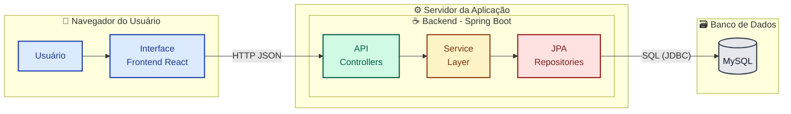

<div align="center">

# 🎓 Sistema de Gestão Acadêmica v2.0 🚀

### A Evolução de uma Aplicação CLI para uma Solução Full-Stack Moderna

</div>

<p align="center">
  
  
  
  
  
  
</p>

---

## 📜 Índice Rápido

| [Sobre o Projeto](#-sobre-o-projeto) | [Funcionalidades](#-funcionalidades) | [Tecnologias](#-tecnologias-utilizadas) |
| :--- | :--- | :--- |
| [Estrutura Monorepo](#-estrutura-do-projeto) | [Como Executar](#-configuração-e-execução) | [Credenciais Padrão](#-credenciais-de-acesso) |
| [Fluxo da Aplicação](#-fluxo-da-aplicação) | [Endpoints da API](#-endpoints-da-api) | [Detalhamento Técnico](#-detalhamento-técnico-profundo) |
| [Versão CLI Legada](#-versão-cli-legada-v10) | [Roadmap Futuro](#-roadmap-futuro) | [Licença](#-licença) |

---

<a name="-sobre-o-projeto"></a>
## 🌟 Sobre o Projeto

O **UniEsquina v2.0** representa a completa modernização e reengenharia de um sistema de gestão acadêmica, transformando uma robusta aplicação de console (CLI) em uma solução **Full-Stack** dinâmica e interativa. O projeto foi meticulosamente refatorado para adotar as melhores práticas do mercado, com um backend poderoso em **Spring Boot** e um frontend reativo construído com **React**.

Esta nova versão não apenas replica, mas expande as funcionalidades originais, oferecendo uma experiência de usuário rica através de interfaces web dedicadas para os perfis de **Administrador** e **Aluno**, com um sistema de autenticação e registro.

<a name="-funcionalidades"></a>
## ✨ Funcionalidades

### 🏢 **Painel do Administrador**
O centro de controle total do sistema, acessível apenas por usuários ADM.

- 🔐 **Login Seguro:** Acesso a uma área restrita.
- 📊 **Dashboard Modular:** Interface com barra lateral de navegação para acesso rápido a todas as funcionalidades.
- 👨‍🎓 **Gestão de Alunos (CRUD Completo):**
    - 📋 **Listar** todos os alunos com busca e paginação (futura).
    - ✅ **Cadastrar** novos alunos com validação de dados em tempo real e seleção de cursos buscados diretamente da API.
    - ✏️ **Editar** informações completas de alunos já cadastrados.
    - 🗑️ **Deletar** alunos do sistema (com remoção em cascata das turmas).
- 🏫 **Gestão de Turmas (CRUD Completo):**
    - 📄 **Listar** todas as turmas, seus cursos e quantidade de alunos.
    - ✅ **Criar** novas turmas, associando-as a um curso existente.
    - 🗑️ **Deletar** turmas.
    - 🔎 **Gerenciar** uma turma específica, com funcionalidades para:
        - ➕ **Adicionar** alunos existentes à turma através de uma busca por nome com autocomplete.
        - ➖ **Remover** alunos da turma com um clique.

### 🧑‍🎓 **Portal do Aluno**
Uma área pessoal e informativa para cada aluno matriculado.

- 🔑 **Login e Registro:** Alunos com matrículas válidas podem criar e acessar suas contas.
- 🎨 **Dashboard Personalizado:** Interface limpa e caprichada para visualização de dados.
- ℹ️ **Minhas Informações:** Um cartão detalhado com todos os dados pessoais e acadêmicos do aluno logado.
- 📚 **Minhas Turmas:** Uma lista de todas as turmas em que o aluno está atualmente matriculado.

---
<a name="-tecnologias-utilizadas"></a>
## 🛠️ Tecnologias Utilizadas

| Área | Tecnologia | Descrição |
| :--- | :--- | :--- |
| ☁️ **Backend** | **Java 17+** | Linguagem principal da aplicação. |
| | **Spring Boot 3.x**| Framework para criação da API REST e gerenciamento da aplicação. |
| | **Spring Data JPA**| Camada de abstração para persistência de dados. |
| | **Hibernate** | Implementação do JPA para mapeamento objeto-relacional (ORM). |
| | **Maven** | Gerenciador de dependências e build do projeto. |
| 🌐 **Frontend** | **React 18+** | Biblioteca para construção da interface de usuário (UI). |
| | **Vite** | Ferramenta de build e servidor de desenvolvimento de alta performance. |
| | **JavaScript (ES6+)**| Linguagem principal para a lógica do frontend. |
| | **CSS3** | Estilização dos componentes para uma interface moderna. |
| 🗃️ **Banco de Dados**| **MySQL 8.x** | Sistema de Gerenciamento de Banco de Dados Relacional. |
| 🔄 **Controle de Versão**| **Git & GitHub** | Gerenciamento de código fonte e versionamento. |

---
<a name="-estrutura-do-projeto"></a>
## 📂 Estrutura do Projeto

O projeto adota uma arquitetura **monorepo**, com o código do backend e do frontend logicamente separados em pastas distintas, mas contidos no mesmo repositório para facilitar o gerenciamento.

```
FaculdadeCRUD_ProjetoFinal/
├── .git/
├── .gitignore          # 📜 Arquivo de ignore unificado para ambos os projetos.
├── backend/            # ☕ Projeto Backend (Spring Boot API)
│   ├── src/
│   └── pom.xml
├── frontend/           # ⚛️ Projeto Frontend (React + Vite)
│   ├── public/
│   ├── src/
│   └── package.json
└── README.md           # 📍 Você está aqui!
```
---
<a name="-configuração-e-execução"></a>
## 🚀 Configuração e Execução

Siga os passos abaixo para executar a aplicação completa na sua máquina local.

### Pré-requisitos
- **Java JDK:** Versão 17 ou superior.
- **Maven:** Instalado e configurado no `PATH` do sistema.
- **Node.js:** Versão 18 ou superior (inclui o `npm`).
- **MySQL:** Servidor de banco de dados rodando (XAMPP, Docker, etc.).
- **Git:** Para clonar o repositório.

### 1. Backend (API Spring Boot)
1.  **Crie o Banco de Dados:** No seu cliente MySQL, execute:
    ```sql
    CREATE DATABASE IF NOT EXISTS faculdade;
    ```
2.  **Configure a Conexão:** Abra o arquivo `backend/src/main/resources/application.yml` e insira suas credenciais do MySQL nos campos `username` e `password`.
3.  **Execute a Aplicação:** Abra um terminal dentro da pasta `backend/` e rode o comando Maven:
    ```bash
    # No Windows
    mvnw.cmd spring-boot:run

    # No Mac/Linux
    ./mvnw spring-boot:run
    ```
    Ou, se preferir, importe o projeto em sua IDE (Eclipse, IntelliJ) como um "Existing Maven Project" e execute a classe principal `FaculdadeCrudApplication.java`.
4.  O backend estará rodando em `http://localhost:8080`. A primeira execução criará e populará as tabelas automaticamente através do `data.sql`.

### 2. Frontend (Interface React)
1.  **Abra outro terminal**, separado do backend.
2.  **Navegue até a pasta do frontend:**
    ```bash
    cd frontend
    ```
3.  **Instale as dependências** (só precisa fazer isso na primeira vez):
    ```bash
    npm install
    ```
4.  **Inicie o servidor de desenvolvimento do Vite:**
    ```bash
    npm run dev
    ```
5.  Abra seu navegador e acesse o endereço fornecido, que geralmente é `http://localhost:5173`.

---
<a name="-credenciais-de-acesso"></a>
## 🔑 Credenciais de Acesso

Use as seguintes credenciais padrão para testar os diferentes perfis de usuário. Elas são criadas automaticamente pelo `data.sql`.

| Perfil | Email | Senha |
| :--- | :--- | :--- |
| 👑 **Administrador** | `matheuscunhaprado@gmail.com` | `Cunha123` |
| 🧑‍🎓 **Aluno 1** | `silviovidal@gmail.com` | `MatheusLindo` |
| 🧑‍🎓 **Aluno 2** | `bortoleto@outlook.com` | `Bortoleto123` |

---
<a name="-fluxo-da-aplicação"></a>
## 🔄 Fluxo da Aplicação

O diagrama abaixo ilustra a arquitetura e o fluxo de comunicação da aplicação.


```mermaid
graph LR
    %% 👤 Navegador do Usuário
    subgraph "👤 Navegador do Usuário"
        A[Usuário] --> B[Interface\nFrontend React];
    end

    %% ⚙️ Servidor da Aplicação
    subgraph "⚙️ Servidor da Aplicação"
        subgraph "☕ Backend - Spring Boot"
            direction TB
            C[API\nControllers] --> S[Service\nLayer] --> R[JPA\nRepositories];
        end
    end

    %% 🗃️ Banco de Dados
    subgraph "🗃️ Banco de Dados"
        D[(MySQL)];
    end

    %% Conexões
    B -- "HTTP JSON" --> C;
    R -- "SQL (JDBC)" --> D;

    %% Estilos personalizados
    classDef frontend fill:#dbeafe,stroke:#1e40af,stroke-width:2px,color:#1e3a8a;
    classDef backendApi fill:#d1fae5,stroke:#065f46,stroke-width:2px,color:#065f46;
    classDef backendService fill:#fef3c7,stroke:#92400e,stroke-width:2px,color:#78350f;
    classDef backendRepo fill:#fee2e2,stroke:#991b1b,stroke-width:2px,color:#7f1d1d;
    classDef db fill:#e5e7eb,stroke:#374151,stroke-width:2px,color:#111827;

    class A,B frontend;
    class C backendApi;
    class S backendService;
    class R backendRepo;
    class D db;


```

---
<a name="-endpoints-da-api"></a>
## 🌐 Endpoints da API

A API REST do backend expõe os seguintes endpoints principais:

| Verbo HTTP | Endpoint | Descrição |
| :--- | :--- | :--- |
| `POST` | `/api/login` | Autentica um usuário e retorna seus dados. |
| `POST` | `/api/registrar` | Registra um novo login para um aluno com matrícula válida. |
| `GET` | `/api/alunos` | Lista todos os alunos. |
| `GET` | `/api/alunos/buscar` | Busca alunos por parte do nome (`?nome=...`). |
| `POST` | `/api/alunos` | Cria um novo aluno. |
| `PUT` | `/api/alunos/{matricula}` | Atualiza os dados de um aluno. |
| `DELETE` | `/api/alunos/{matricula}` | Deleta um aluno. |
| `GET` | `/api/turmas` | Lista todas as turmas. |
| `POST`| `/api/turmas` | Cria uma nova turma. |
| `DELETE`| `/api/turmas/{id}`| Deleta uma turma. |
| `POST`| `/api/turmas/{id}/alunos` | Adiciona um aluno a uma turma. |
| `DELETE`| `/api/turmas/{id}/alunos/{mat}` | Remove um aluno de uma turma. |
| `GET` | `/api/cursos` | Lista todos os cursos disponíveis. |

---
<a name="-detalhamento-técnico-profundo"></a>
## 🔬 Detalhamento Técnico Profundo

* **Backend - Arquitetura em Camadas:** O projeto adota o padrão **Controller-Service-Repository**, garantindo uma clara separação de responsabilidades.
    -   `Controller`: Recebe requisições HTTP e orquestra a resposta.
    -   `Service`: Contém a lógica de negócio complexa (ex: geração de matrícula).
    -   `Repository`: Interface do Spring Data JPA responsável pela comunicação com o banco de dados.
* **Backend - Persistência com JPA:** A migração de JDBC para **Spring Data JPA** abstraiu toda a complexidade de escrita de SQL, gerenciamento de conexões e mapeamento de resultados. O uso de interfaces `JpaRepository` permite que o Spring crie as queries em tempo de execução, incluindo buscas customizadas como `findByMatricula` e `findByNomeContainingIgnoreCase`.
* **Backend - Inicialização de Dados:** A estratégia final e robusta utiliza um script `data.sql` **idempotente** com `CREATE TABLE IF NOT EXISTS` e `INSERT IGNORE`, combinado com `ddl-auto: none` no `application.yml`. Isso garante que o banco de dados tenha a estrutura e os dados iniciais corretos em qualquer ambiente, sem apagar os dados existentes em execuções subsequentes.
* **Frontend - Arquitetura de Componentes:** A interface foi construída em **React**, quebrando a UI em componentes reutilizáveis (`LoginForm`, `AlunoList`, `Sidebar`, etc.), cada um com seu próprio estado e lógica.
* **Frontend - Gerenciamento de Estado:** O estado da aplicação (ex: qual usuário está logado, qual tela está visível) é gerenciado no componente pai (`App.jsx`) e distribuído para os componentes filhos através de **props**. Esse padrão, conhecido como **"Lifting State Up"**, centraliza o controle e facilita a comunicação entre componentes.
* **Frontend - Efeitos e Data Fetching:** O "hook" `useEffect` é utilizado para disparar chamadas assíncronas à API (`fetch`) no momento em que os componentes são montados na tela, permitindo que a UI seja populada com dados vindos do backend.

---
<a name="-versão-cli-legada-v10"></a>
## 💾 Versão CLI Legada (v1.0)

A versão original deste projeto, uma aplicação de console totalmente funcional, foi preservada e está disponível para consulta no **[Release v1.0-cli](https://github.com/MathCunha16/faculdade-crud/releases/tag/v1.0-cli)** do repositório.

---
<a name="-roadmap-futuro"></a>
## 📈 Roadmap Futuro

- [ ] **Segurança da API:** Implementar autenticação baseada em tokens (JWT) para proteger os endpoints.
- [ ] **Testes:** Adicionar testes unitários (JUnit no backend, Vitest/RTL no frontend).
- [ ] **Paginação:** Implementar paginação nas listas de alunos e turmas para melhor performance com grandes volumes de dados.
- [ ] **Melhorias de UX:** Substituir `alert()`s por um sistema de notificações (toasts) mais elegante.
- [ ] **Refatoração:** Mover lógicas de negócio adicionais dos controllers para a camada de Serviço.

---
<a name="-licença"></a>
## 📄 Licença
Distribuído sob a Licença MIT.
